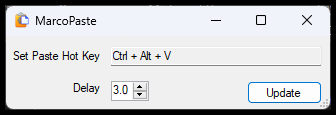

# MacroPaste

**MacroPaste** is a lightweight utility designed to simulate keystrokes for clipboard content, enabling paste functionality in environments where traditional copy/paste fails—such as VMware consoles, Dell iDRAC, Lenovo IMM, and other remote KVM or management interfaces.

By default, MacroPaste uses the hotkey **Ctrl + Alt + V** to "type out" the contents of your clipboard, bypassing restrictions in non-standard input environments.

---

## Features
- Simulates keystrokes from clipboard content
- Default hotkey: **Ctrl + Alt + V**
- Tray application with hotkey customization
- Perfect for remote consoles and admin tools that block paste functionality

---

## Getting Started
Once launched, MacroPaste runs in the system tray for quick access.

### 
Right-click the tray icon and choose **Set Hotkey** to configure your preferred activation key.

---

## Setting the Hotkey
### 
1. Click inside the **Hotkey** text box.
2. Press your desired key combination.
3. Adjust the Paste Time Delay if necessary.
4. Click **Update** to update settings.
---

## Using MacroPaste
### 
When you're in a remote interface that doesn’t support paste, simply use your configured hotkey (default: **Ctrl + Alt + V**) and MacroPaste will count down then type out the contents of your clipboard.

---

## Notes
- Ensure MacroPaste is running and visible in the tray before use.
- If the tool isn't working, verify that your hotkey doesn't conflict with another application.
